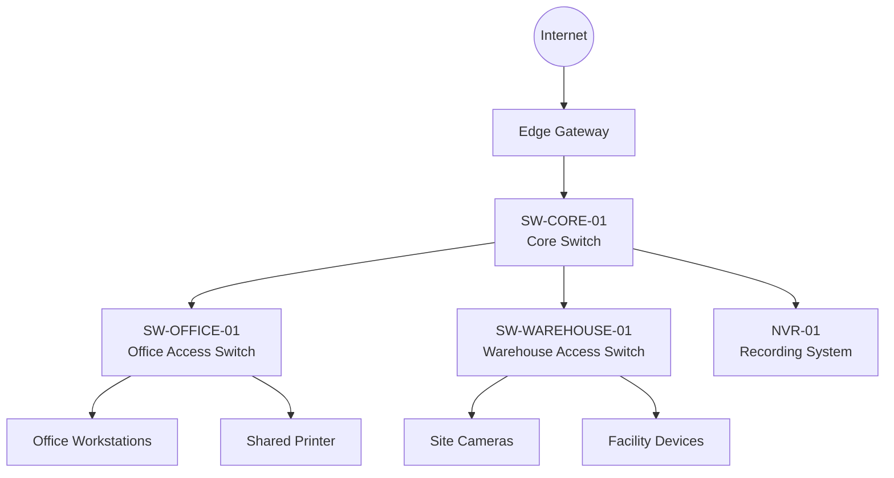

# Network Documentation Lab

A simulated network documentation project for a small office and warehouse environment. It includes network topology, VLAN planning, IP address planning, switch port mapping, patch panel mapping, site camera documentation, and troubleshooting notes.

This project is designed as a portfolio project for **IT Support, Field IT Support, Desktop Support, Junior Network Support, and Technical Support** roles.

> This lab uses simulated data only. It does not contain any real company, customer, site, or production network information.

---

## Project Purpose

In real IT support and network support environments, technical documentation is essential for troubleshooting, handover, maintenance, and site support.

This project demonstrates how to document a small office / warehouse network in a clear and practical way.

It is based on common support scenarios such as:

- Setting up a new office or warehouse site
- Mapping switch ports and patch panel connections
- Documenting wall outlets and device locations
- Recording IP camera and shared device connections
- Maintaining an IP address and VLAN plan
- Creating troubleshooting notes for onsite support

---

## Scenario

The simulated site includes:

- One office area
- One warehouse area
- One server room / communications rack
- One core switch
- Two access switches
- Corporate users and laptops
- Guest Wi-Fi
- Shared services
- Site cameras and recording equipment
- Printers and facility devices

---

## Repository Structure

```text
network-documentation-lab/
├── data/
│   ├── cctv_device_register.csv
│   ├── ip_address_plan.csv
│   ├── patch_panel_map.csv
│   └── switch_port_map.csv
├── diagrams/
│   ├── network-topology.md
│   └── vlan-layout.md
├── documentation/
│   ├── cctv-device-register.md
│   ├── ip-address-plan.md
│   ├── network-overview.md
│   ├── patch-panel-map.md
│   ├── switch-port-map.md
│   └── troubleshooting-notes.md
└── README.md
```

---

## Main Documentation

| Document | Purpose |
|---|---|
| [Network Overview](documentation/network-overview.md) | Explains the simulated site and documentation goals |
| [Network Topology](diagrams/network-topology.md) | Shows the high-level office and warehouse topology |
| [VLAN Layout](diagrams/vlan-layout.md) | Shows the logical VLAN / network segment layout |
| [IP Address Plan](documentation/ip-address-plan.md) | Documents subnets and network segment purposes |
| [Switch Port Map](documentation/switch-port-map.md) | Maps switch ports to devices, uplinks, and areas |
| [Patch Panel Map](documentation/patch-panel-map.md) | Maps patch panel ports to wall outlets and switch ports |
| [Camera Device Register](documentation/cctv-device-register.md) | Records simulated camera and recording devices |
| [Troubleshooting Notes](documentation/troubleshooting-notes.md) | Provides basic support notes for common issues |

---

## Data Files

| Data file | Description |
|---|---|
| [`data/ip_address_plan.csv`](data/ip_address_plan.csv) | VLAN names, subnets, and purposes |
| [`data/switch_port_map.csv`](data/switch_port_map.csv) | Switch ports, connected devices, VLANs, and locations |
| [`data/patch_panel_map.csv`](data/patch_panel_map.csv) | Patch panel ports, wall outlets, and switch port references |
| [`data/cctv_device_register.csv`](data/cctv_device_register.csv) | Simulated camera and recording device register |

---

## Network Topology Preview

The topology is written in Mermaid and can be viewed directly on GitHub:



---

## Skills Demonstrated

This project demonstrates practical skills in:

- Network documentation
- IT support handover documentation
- Switch port mapping
- Patch panel and wall outlet mapping
- VLAN and IP address planning
- Site device register maintenance
- Camera / recording device documentation
- Basic troubleshooting workflow writing
- Clear Markdown documentation
- GitHub-based technical portfolio presentation

---

## Portfolio Relevance

This project is especially relevant to roles such as:

- IT Support Technician
- Desktop Support Technician
- Field IT Support Technician
- Junior Network Support
- Technical Support Officer
- Network Support Intern
- Site Support Technician

It shows that I understand not only troubleshooting, but also the documentation and handover practices required to support real office, warehouse, and site-based IT environments.

---

## Future Improvements

Planned improvements include:

- Add a visual topology image in `assets/`
- Add a rack layout diagram
- Add a wireless access point placement map
- Add a change log template
- Add a site handover checklist
- Add a small Python script to validate CSV documentation consistency
