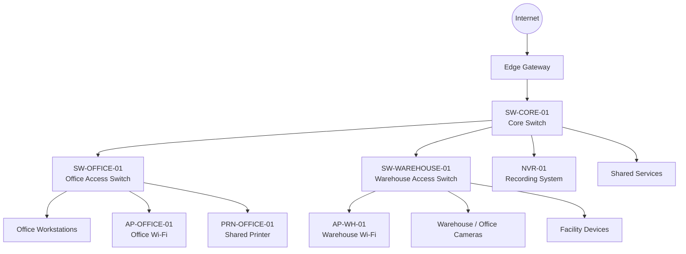

# Network Topology

This page uses Mermaid to show the simulated network topology for the office and warehouse site.

## Reading the Diagram

- The edge gateway connects the site to the outside network.
- The core switch connects the main site segments.
- Office and warehouse access switches connect local endpoints.
- Site camera devices and facility devices are documented separately from user workstations.
- Shared services and recording equipment are placed in the server room / communications rack.

## Notes

This is a simulated topology for documentation practice. It does not represent any real company network.
