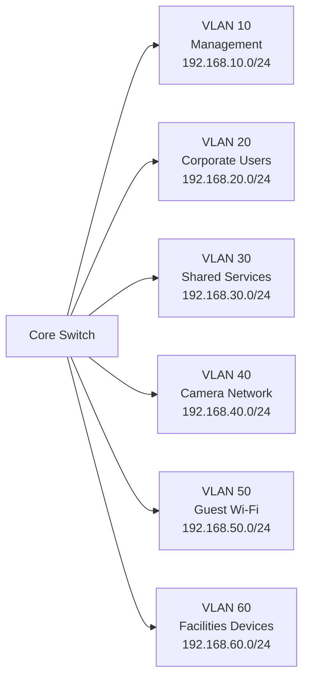

# VLAN Layout

This page shows the simulated VLAN layout used in the network documentation lab.

## VLAN Summary

| VLAN | Name | Purpose |
|---:|---|---|
| 10 | Management | Network device administration |
| 20 | Corporate Users | Office workstations and laptops |
| 30 | Shared Services | Shared business systems and internal services |
| 40 | Camera Network | Site camera and recording devices |
| 50 | Guest Wi-Fi | Guest internet access |
| 60 | Facilities Devices | Printers, scanners, and facility devices |

## Support Notes

- VLAN documentation should be consistent with the IP address plan.
- Device labels should match the switch port map and patch panel map.
- Guest Wi-Fi and user devices should be documented as separate service groups.
- Camera and facility devices should be easy to identify for onsite troubleshooting.
